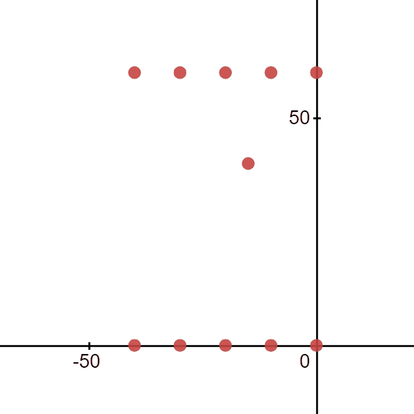

# Ultrasonic_Phased_Array
This repository contains all the sources for a working ultrasonic phased array.
The vitis project in this repository is to be used in a accoustic levitation example.

## abstract
When we power up the system, the transducers start emitting ultrasonic sound waves each at the same frequency (40kHz) and amplitude. However, the phases of the transducers are software controllable. This gives us full control over the beam shape exiting the transducer array.

## Working principle

## Setup
There are two array's used in the levitation example. One is facing upwards and the other is facing downwards. They are facing eachother with a distance of 70mm. this distance is arbitrarily chosen based on the needed volume for levitation.
