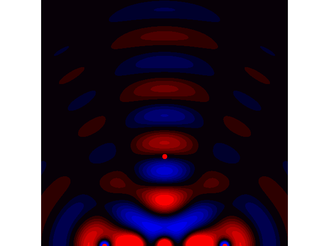

# Ultrasonic_Phased_Array
This repository will contain all the sources for a working ultrasonic phased array.
The vitis project in this repository is to be used in a accoustic levitation example.

## abstract
When we power up the system, the transducers start emitting ultrasonic sound waves each at the same frequency (40kHz) and amplitude. However, the phases of the transducers are software controllable. This gives us full control over the beam shape and direction exiting the transducer array.

## Working principle
Lets consider an example where we want to send a single pulse of airpressure to a certain point in space. We have an array of transducers we can work with. Since the waves travel in a sphere around the transducers, we can time the pulses at each transducer in such a way that all the wavefronts arrive at the same time in a single point. This is illustrated in the animation below.
 

 
If we were to send a sinewave with the same delay through the transducers instead of a single pulse, all the peaks and troughs of those waves would ideally only add up in the focal point. The amplitude would then be the greatest at that point and ideally cancel out everywhere else. This is actually not always the case because a side effect of using a periodic signal is that we create te posibility of sidelobes. Sidelobes are areas where some of the sinewaves add up unwantedly. To prevent the occurance of sidelobes, we need to space the transducers with a distance between 1/2 wavelength, and 1/4 wavelength. 

The waves of exiting the transducers will look something like this.
 

 
The red dots at the bottom are sources emitting pure sinusodial signals with an adjusted phase delay so all the waves are in phase at the red dot around the middle.

## Setup
There are two array's used in the levitation example. One is facing upwards and the other is facing downwards. They are facing eachother with a distance of 70mm. This distance is arbitrarily chosen based on the needed volume for levitation.

## FPGA
The FPGA used in this project is the ZYNQ XC7Z020 on a Zybo Z7 board. It contains two distinct parts: The processing system (PS) and the programmable logic (PL):

### Programmable Logic
The PL contains an implementation which receives 7 bit values from the PS (Processing System) for every transducer. This value sets the phase of the output signal. This is acheived by making a fifo of length = 2^7 in the case of a phase resolution of 7 bits. The 40KHz signal is fed into the fifo at 40KHz * 2^7 = 5.12MHz. The reason for this is because we want exactly 1 full period of the signal in the fifo. The 7 bit value determines at which address of the fifo the output signal is tapped from. This way wan can adjust the phase of the output signal in 2^7 steps per period.
Im currently cleaning up the FPGA implementation and turning it into an IP-block, i will include the files in this repository once i'm finished.

### Processing System
TODO
